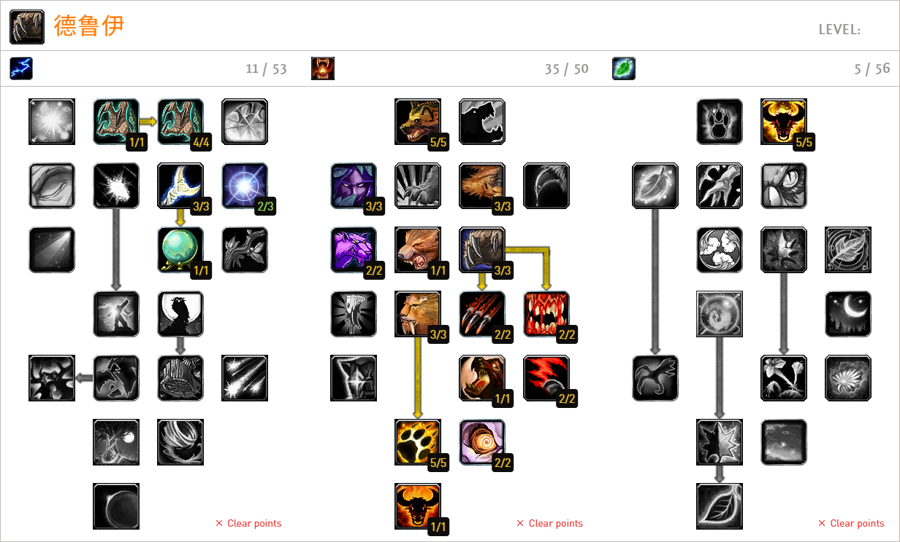

# 熊德辅助插件


## 功能
- 可视化设置
- 无脑一键
- 施放通报
- 等...


## 使用
- 安装`!Libs`插件
- [可选][[文档](https://github.com/xhwsd/SuperMacro/)][[下载](https://github.com/xhwsd/SuperMacro/archive/master.zip)]安装`SuperMacro`插件，安装后将获得更多宏位
- [[文档](https://github.com/xhwsd/DruidBear/)][[下载](https://github.com/xhwsd/DruidBear/archive/main.zip)]安装`DruidBear`插件
- 基于插件提供的函数，创建普通或超级宏
- 将宏图标拖至动作条，然后使用宏

> 确保插件最新版本、已适配乌龟服、目录名正确（如删除末尾`-main`、`-master`等）


## 可用宏

### 拉单

> 单拉一个目标使用

```
/script -- CastSpellByName("槌击")
/script DruidBear:PullSingle()
```

逻辑描述：
- 会在健康、无怒气时使用狂怒
- 会在濒死时使用狂暴回复
- 会对目标使用精灵之火


### 拉群

> 群拉多个目标使用

```
/script -- CastSpellByName("挥击")
/script DruidBear:PullGroup()
```

逻辑描述：
- 会在健康、无怒气时使用狂怒
- 会在濒死时使用狂暴回复
- 会对目标使用精灵之火
- 会对目标使用挫志咆哮
- 会在怒气太多时使用野蛮撕咬


## 参考天赋
[](https://talents.turtle-wow.org/druid?points=BgAaAIAAAAAAAAFAYYRYDSAKFQBAAoAAAAAAAAAAAAA=)
